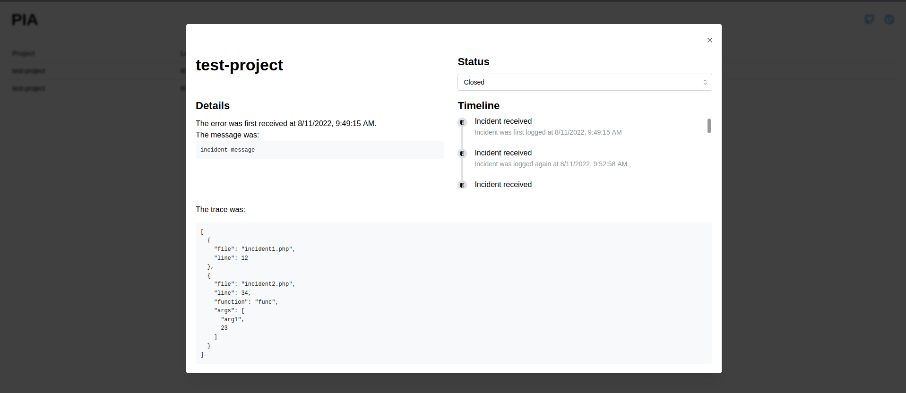

# PHP Incident Aggregator (PIA)
PIA introduces a straightforward way to aggregate and track all your project's PHP exceptions in one place.


## Current features
* Multiple project support by storing each incident with a project's name.
* Duplicated exceptions will not create duplicate incidents, but register the time of each duplicate under the same incident on a timeline.
* Store incident status to track bug solving progress (Open, Investigating, Identified, Solved).
* The entire stack trace is stored to easily identify the root of a bug.
## Planned features
* Filter and search projects
* Display stack trace with an interactive interface, instead of dumping JSON.
* A sidebar to switch between projects
* Add a comment to an incident for bug documentation
* Allow the user to log out
## Usage
For a quick test add the following enviroment variables to a `.env` file 
```
JWT_SECRET= 
JWT_REFRESH_TOKEN=

FRONTEND_URL=http://localhost:3000
```

To generate secrets you can run the following on a node terminal
```
require('crypto').randomBytes(64).toString('hex')
```

And finally run the following on the root directory
```
make build-dev
make run-dev
```

You should now be able to access the app on http://localhost:3000
## Techologies, stack, and geek stuff
This application uses the **MERN stack**, meaning persistent storage is handled on a **MongoDB database**, the frontend runs with **React** (with an **NGINX server** on production), and the backend was made with **Node and express**.

Additionally, the entire app is **dockerized** to ease deployment and simplify developer configuration, with **makefiles** to easily run complex docker commands.

## License
This project is under the MIT license. Please see [LICENSE](LICENSE) for details.